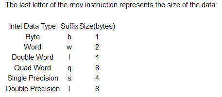
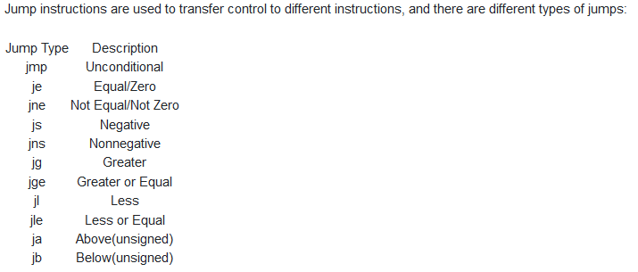

**Introduction**  
Computers execute machine code encoded in bytes to carry out tasks. Cause of different processors present in the computers, machine code is specific to the processor. This can be used as a reference to Intel x86-64 instruction set. Machine code is usually represented by a more readable Assembly code and this code is usually produced by a compiler. 

Open the code for debugging purposes -  
```
rd -d file
```
To analyse the program -  
```
aa
```
Changing the syntax to ATT -  
```
e asm.syntax=att
```
To check the list of all the functions -  
```
afl
```
To examine a particular function -  
```
pdf @func
```
The core of assembly language involves using registers to do the following:  
+ Transfer data between memory and register and vice versa
+ Perform arithmetic operations on registers and data. 
+ Transfer control to other parts of the program. 

To move data using registers -  
```
movq source, destination
```
To move constants, we prefix them with $ (eg - movq $3 rax)  
To move between registers we prefix them with % (eg - movq %rax %rbx)  
Transferring values from memory which is shown by putting registers inside brackets e.g. movq %rax (%rbx) which means move value stored in %rax to memory location represented by %rbx  



Some other important instructions are:  
+  leaq source, destination- this instruction sets destination to the address denoted by the expression in source
+  addq source, destination- destination = destination + source
+  subq source, destination- destination = destination - source
+  imulq source, destination- destination = destination * source
+  salq source, destination- destination = destination << source where << is the left bit shifting operator
+  sarq source, destination- destination = destination >> source where >> is the right bit shifting operator
+  xorq source, destination- destination = destination XOR source
+  andq source, destination- destination = destination & source
+  orq source, destination- destination = destination | source

**IF Statements -**  
if(condition){  
    do-things  
}  
else if(condition){  
    do-things  
}  
else{  
    do-things  
}  

They use 3 important instructions - 
+ compq source2, source1 - computing a-b without setting destination
+ testq source2, source1 - Computing a&b without setting destination
+ Jump statements  


To create a breakpoint in radare2 - 
```
db address
```
```
dc - to execute program till breakpoint. 
```
```
dr - to check the register values
```
```
ds - to execute next instruction
```

**LOOPS -**  

while(condition){  
  Do-stuff-here  
  Change value used in condition  
}  

for(initialise value: condition; change value used in condition){  
  do-stuff-here  
}  

